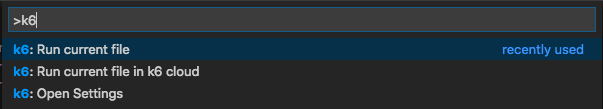

# k6

Enhances Visual Studio Code with the ability to run k6 tests both on your local machine and in the Grafana Cloud.

## Install

Install the extension from the [Visual Studio Marketplace](https://marketplace.visualstudio.com/items?itemName=k6.k6) or [Open VSX](https://open-vsx.org/extension/k6/k6).

### For more information

- [k6.io](https://k6.io)
- [Grafana k6 Documentation](https://grafana.com/docs/k6)

**Enjoy!**
